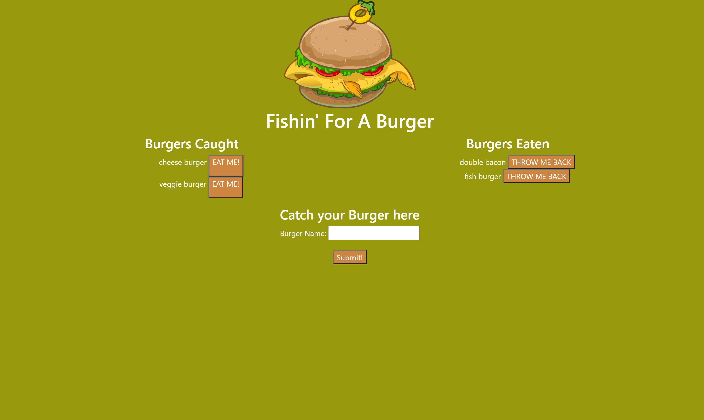

# burger-log

## DESCRIPTION

Do you want to eat a burger but you can't? Here, you have the Fishin' for a Burger application where you can pretend to eat one!

This application was difficult to put together, but after I was finally able to do it, the swell of pride made it all worth it. After hours of problem after problem after problem, restarting all together, and eating my feelings, I got this application the way I wanted it to look and I'm very proud of it! This was the project that truly reminded me how much I have learned since starting the course. I was able to find my own mistake and understand why they were mistakes and how they needed to be fixed, and because of that, I am beginning to feel more confident about my coding ability!

## TABLE OF CONTENTS

\*[Installation](#Installation)

\*[Usage](#Usage)

\*[License](#License)

\*[Contributing](#Contributing)

\*[Tests](#Tests)

\*[Questions](#Questions)

## LAYOUT

Official site: https://burger-eating-logger.herokuapp.com/

Here's what the application looks like!

## INSTALLATION

All you need to do to use this application is find it on Heroku! The link to is found in the LAYOUT section of this README.

## USAGE

The application is just a fun little game of eating the burger, making your own burgers, and eating those too!

## LICENSE

This application is licensed under the MIT license.

Find out more about the license here:

(https://opensource.org/licenses/MIT)

## CONTRIBUTING

I want to thank the other classmates from the Boot Camp who come together to work as a team, answer questions anyone has, and helps however they could!

## QUESTIONS

For any questions, contact me:

Github: https://www.github.com/jamjon94

email: jamie.mar.jones14@gmail.com
